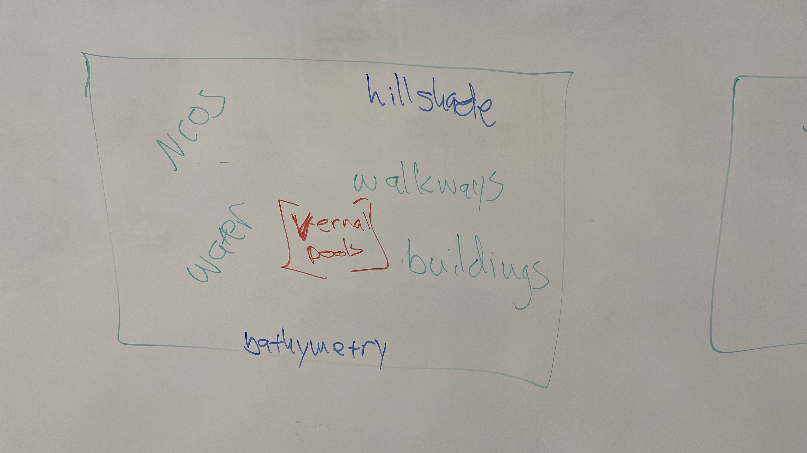

# geospatialRUCSBAtlas
A repo that uses local UCSB examples from the R for GeoSpatial workshop.

Scripts run parallel to the episodes of Raster and Vector Data with R Data Carpentry.
The goal is to produce several nice atlas pages of campus that use all the techniques
covered in the Intro to GeoSpatial R Carpentry lesson.

1: Make sure to set up your project with a `source_data` folder,
and copy over and unzip ALL of the data in our google drive:
Carpentry/Workshop Development/Local Data for Workshops/geo. The datasets 
are in flux, so take a look at step 3.

`source_data` is *.* git ignored, so it's probably not going to
get made automatically.

2: Run data_prep.r
The goal is for this script to download, unzip, and prep
any data that's required for the Atlas.

3: now each episode should run nicely

The goal will be to produce a number of well formatted maps.
All with a 3 tall x 4 wide aspect ratio

7 to be exact:
1. A wide view of campus with
  * NCOS
  * Water
  * Bathymentry and elevation
  * hillshade
  * walkways
  * buildings

1. A stylized thematic map with trees, water, and bikeways

1. An atlas page layout with 4 insets:
  1. California
  1. The Bite of California
  1. Extended Campus
  1. extended campus will have maptiles background

[UCSB Carpentry](https://ucsbcarpentry.github.io)
